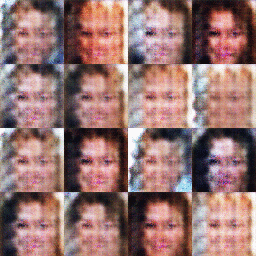
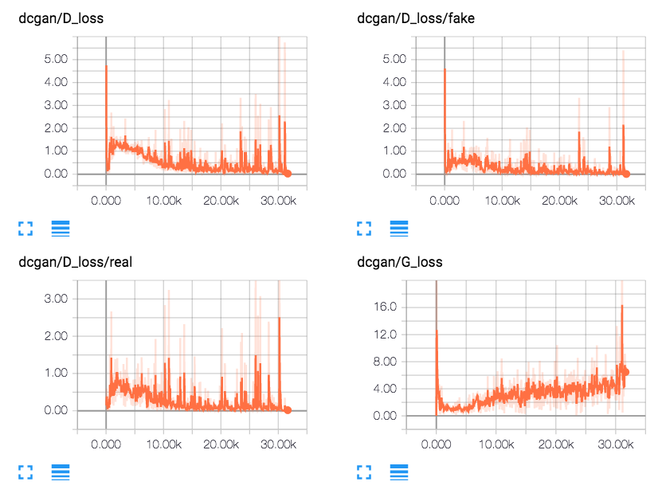
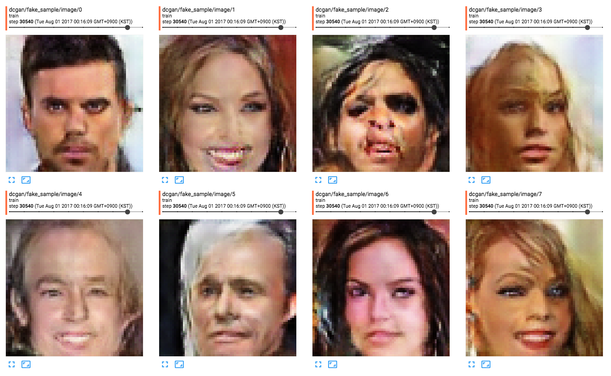
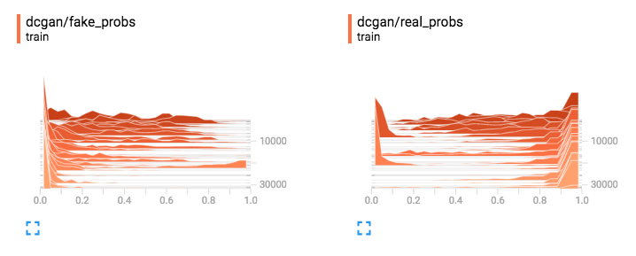

# DCGAN

Based on python 2.7, tensorflow 1.2

* 마지막에 G_loss 가 치솟으면서 이미지가 확 망가지는 현상이 있음. 이유가 뭘까?
* `utils.py` and `inputpipe.py` is general-purpose module - 하지만 refactoring 을 좀 해줘야 할 듯.

## Results

### Movie

### TensorBoard

## ToDo

* [x] Input pipeline
    * Refactoring (maybe someday when use it ...)
* Apply DCGAN to multiple dataset
    * [x] MNIST (DCGAN.ipynb)
    * [x] CelebA
    * [ ] Flower
    * [ ] LSUN
* [x] TensorBoard
    * scalar, histogram, image
* [x] Misc
    * [x] make gif
    * [x] add progress bar
        * tqdm