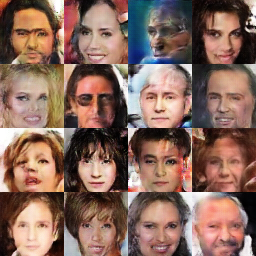

# DCGAN

Based on python 2.7, tensorflow 1.2

* 마지막에 G_loss 가 치솟으면서 이미지가 확 망가지는 현상이 있음. 이유가 뭘까?
    * DCGAN 은 origianl GAN loss 를 minimize 하기 때문에 G_loss 가 아래로 열려 있음 - 즉 lower bound 가 없음. 
    * 이 때문에 D가 optimal 해지면 G_loss 가 치솟으면서 이미지가 망가질 수 있음.
    * 이를 해결하기 위해 여러 방법이 있겠지만 일단 LSGAN 을 쓰면 이런 문제가 없을 것 같다.
* `utils.py` and `inputpipe.py` is general-purpose module - 하지만 refactoring 을 좀 해줘야 할 듯.

## Results

### After 25k-th global step

1 epoch 당 1500~1600 step 정도 되므로(batch size 128), 약 16 epoch 쯤.

### Movie

### TensorBoard

## ToDo

* [x] Input pipeline
    * Refactoring (maybe someday when use it ...)
* Apply DCGAN to multiple dataset
    * [x] MNIST (DCGAN.ipynb)
    * [x] CelebA
    * [ ] Flower
    * [ ] LSUN
* [x] TensorBoard
    * scalar, histogram, image
* [x] Misc
    * [x] make gif
    * [x] add progress bar
        * tqdm
