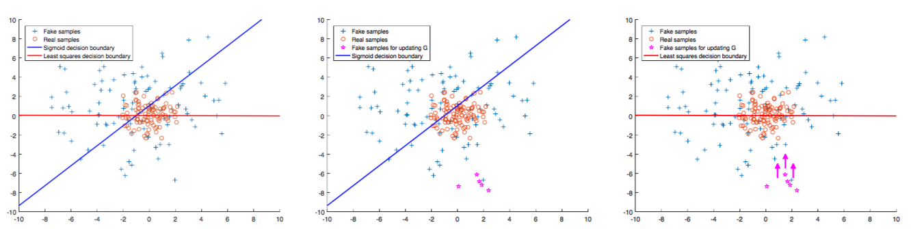

# LSGAN+BGAN

* LSGAN: Mao, Xudong, et al. "Least squares generative adversarial networks." arXiv preprint ArXiv:1611.04076 (2016).
* BGAN: Hjelm, R. Devon, et al. "Boundary-Seeking Generative Adversarial Networks." arXiv preprint arXiv:1702.08431 (2017).

LSGAN 을 읽으면서 생긴 궁금증을 BGAN 이 어느정도 해결해줘서 같이 묶어서 구현한다. 아 근데 boundary-seeking gan 을 bgan 이라고 하는지는 잘 모르겠음.

## LSGAN

* Original GAN 은 sigmoid cross-entropy loss 를 사용하기 때문에 정답이기만 하면 얼마나 정답인지는 별로 고려하지 않는다.
    * linear regression - logistic regression 의 차이를 생각해보면 됨
* 두번째 그림에서, megenta star 가 fake sample 이고, 디시전 바운더리의 아래쪽이 correct side 라고 할 때, 이 fake sample 들은 real sample 들과 많은 차이가 있음에도 불구하고 correct side 에 있기 때문에 더이상 업데이트가 되지 않는다.
* 따라서 이 문제를 개선하기 위해 loss function 을 sigmoid cross-entropy 에서 least square 로 변경.

**GAN**:

$$\min_G \max_D V(D,G) = \mathbb{E}_{x\sim p_{data}~(x)}[log D(x)] + \mathbb{E}_{z\sim p_z(z)}[log(1-D(G(z)))]$$

**LSGAN**:

$$
\begin{align}
&\min_DV_{LSGAN}(D) = \frac{1}{2}\mathbb{E}_{x\sim p_{data}~(x)}[(D(x)-b)^2] + \frac{1}{2}\mathbb{E}_{z\sim p_x(z)}[(D(G(z))-a)^2] \\ 
&\min_G V_{LSGAN}(G) = \frac{1}{2}\mathbb{E}_{z\sim p_z(z)}[(D(G(z))-c)^2] 
\end{align}
$$

* a: fake label
* b: real label
* c: real label for G (G가 D를 속이고자 하는 값 - 보통은 real label)

이 a, b, c 값으로는 크게 두 가지를 제안하였다:

* Pearson $\chi^2$ divergence: a=-1, b=1, c=0.
* Intuitive (real label 1, fake label 0): a=0, b=c=1.

결과는 비슷하다고 함.

### Caution

* D 의 output 을 sigmoid 로 하면 학습이 되지 않는다. 
    * MNIST 는 sigmoid 로 해도 된다. 그래서 첨엔 되는 줄 알았는데 CelebA 나 LSUN 같은건 안됨;
* MSE 니까 sigmoid 로 하면 안되는 게 맞는 것 같음. Logistic regression 이 아니라 Linear regression 으로 discriminator 를 만들겠다는 것. sigmoid 를 쓸거면 log loss (cross-entropy) 를 써야.

### Thinks

* 사실 상식적으로 생각해보면 CE loss 를 쓰는게 맞다. 근데 왜 위 예제에서는 LS loss 가 워킹하냐면 디시전 바운더리가 정확하지 않기 때문임. 다시 말해서 LSGAN 은, 이론적으로는, 디시전 바운더리를 정확히 잡을 수 없을 때 효과적인 방법이라고 할 수도 있음.
* 위에서 Pearson $\chi^2$ divergence 로 나타나는 경우는 generator G 가 D 를 속이기 위해, 즉 D(fake)=1 이 되도록 학습되는 것이 아니라 D(fake)=0 가 되도록 학습됨. fake label 은 -1 이므로, 실제로는 D 가 fake 를 받았을 때 real 인지 fake 인지 모르도록 학습한다고 할 수 있고, D의 디시전 바운더리에 가까워지도록 학습한다고 할 수 있음. 
  * 이게 처음에 이해가 안 되었는데, BGAN 을 참고하자.

## BGAN

http://wiseodd.github.io/techblog/2017/03/07/boundary-seeking-gan/

귀찮… 위 링크 참고.